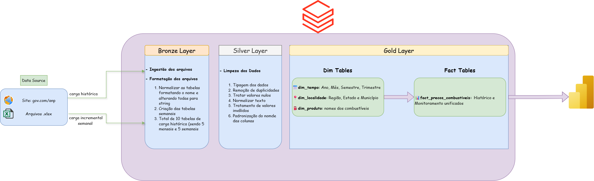

# ⛽ Data Lakehouse ANP: Pipeline de Combustíveis e Analytics

## 📌 Sobre o Projeto

Este repositório contém um projeto de Engenharia de Dados de ponta a ponta, construído para processar e analisar a série histórica e o monitoramento semanal de preços de combustíveis da ANP (Agência Nacional do Petróleo).

O objetivo principal foi criar um pipeline robusto com dados reais e volumosos do governo brasileiro, aplicando a **Arquitetura Medallion** na nuvem da **Azure** utilizando **Databricks** e, por fim, disponibilizando um modelo de dados otimizado para consumo no **Power BI**. O projeto simula desafios reais do dia a dia da área de dados, como inconsistências de schema na fonte (Schema Drift) e otimização de orquestração na nuvem.

---

## 📚 Aprendizados e Decisões Técnicas

Durante o desenvolvimento, diversos conceitos avançados e boas práticas do mercado foram aplicados:

* **Star Schema vs. Snowflake:** Decisão arquitetural de manter a camada Gold em um modelo Estrela com granularidade fina (nível de Município), evitando JOINs custosos e tabelas agregadas redundantes.
* **Tratamento de Valores Nulos em Dimensões:** Aplicação rigorosa das regras de modelagem dimensional de Kimball, garantindo que as dimensões (como a `dim_localidade`) não contenham valores `NULL`, prevenindo quebras nos relatórios de BI e o problema grave de duplicação de dados (Fan-out).
* **Resolução de Schema Drift:** Identificação e correção de inconsistências na fonte de dados, onde as planilhas semanais não possuíam a coluna de Região. Foi desenvolvida uma lógica em SQL (CTE `mapa_regioes`) para deduzir e mapear dinamicamente a região correta com base nos dados do histórico.
* **Otimização de Custos e Orquestração:** Refatoração do DAG no Databricks Jobs & Pipelines. A carga histórica pesada de mais de 10 anos foi separada do Job de atualização semanal, economizando tempo de computação e reduzindo custos na nuvem.

---

## 🚀 O Pipeline Prático: Pipeline de Combustíveis

O pipeline foi estruturado e executado nas seguintes fases:

### 1. Camada Bronze (Ingestão Bruta e Incremental)
* Implementação de Web Scraping com Python (`requests` e `BeautifulSoup`) para acessar a página do governo e extrair automaticamente o link do Excel semanal mais recente.
* Ingestão incremental (`append`) dos dados novos em tabelas no Unity Catalog, mantendo um histórico imutável idêntico à fonte. A carga histórica de 2013 a 2026 foi isolada em um script de Full Load.

### 2. Camada Silver (Limpeza e Transformação)
* Uso de **PySpark** para processar e padronizar o schema de múltiplas abas do Excel.
* Limpeza profunda: remoção de espaços em branco (`TRIM`), conversão de strings para os tipos corretos (`Date` e `Double`), e padronização da nomenclatura das colunas.
* Tratamento inicial de anomalias, convertendo traços (`-`) da planilha original para nulos lógicos antes de salvar em formato Delta.

### 3. Camada Gold (Modelagem para Negócios)
* Refatoração de múltiplas tabelas fato fragmentadas em favor de uma única Tabela Fato consolidada: `fact_precos_combustiveis`.
* Uso de SQL para empilhar (`UNION ALL`) o histórico antigo com o monitoramento semanal, equalizando a estrutura através da injeção de `NULL` nas métricas de distribuição ausentes no arquivo recente.
* Geração de três dimensões robustas: `dim_produto`, `dim_tempo` e a `dim_localidade` (tratada para não conter nulos e garantir unicidade por município).

### 4. Orquestração (Databricks Workflows)
* Automação do pipeline em um DAG semanal otimizado, composto por 4 tarefas sequenciais:
  1. `extracao_semanal`
  2. `silver_cleaning_semanal`
  3. `gold_dim`
  4. `gold_fact_consolidada`
* Mapeamento de dependências estrito, eliminando Condições de Corrida (*Race Conditions*) ao garantir que a Tabela Fato só inicie seu processamento após a atualização completa de todas as tabelas de Dimensão.

